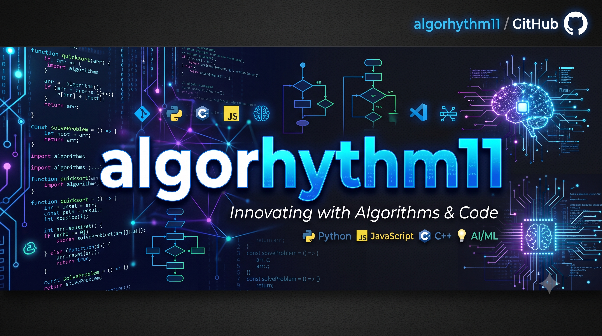
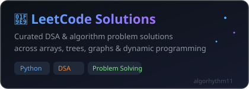
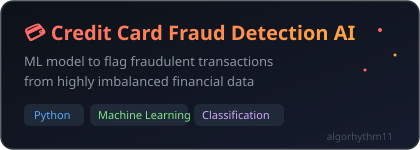
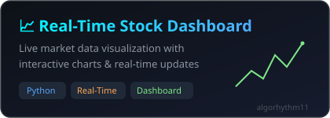

<div align="center">



</div>

<div align="center">

<a href="https://git.io/typing-svg">
  
</a>

<br/>


</div>

---

### 🚀 About Me

- 💻 Software Engineer / AI-ML practitioner who loves building things that **actually ship**
- 🔭 Currently building projects around **Python, Deep Learning & Backend Systems**
- 🌱 Deep-diving into **CNNs, System Design, and Cloud Architecture**
- 💡 I enjoy solving DSA & LeetCode problems and optimizing algorithms
- ⚡ Fun fact: I debug with `print()` before I admit I need a real debugger

<details>
<summary>🐍 View as Python (click to expand)</summary>

```python
class Algorhythm11:
    def __init__(self):
        self.role = "SDE | AI/ML Engineer"
        self.stack = ["Python", "Deep Learning", "React", "Backend Systems"]
        self.currently = "Building production-ready ML & full-stack projects"
        self.learning = ["System Design", "CNNs", "Cloud Architecture"]
        self.fun_fact = "Debugs with print() before admitting defeat to pdb"

    def say_hi(self):
        print("Thanks for stopping by, let's build something great!")
```

</details>

---

### 🛠️ Tech Stack

<table align="center">
<tr>
<td align="center" valign="top" width="33%">

**Languages**
<br/>


</td>
<td align="center" valign="top" width="33%">

**Web / Frontend**
<br/>


</td>
<td align="center" valign="top" width="33%">

**Backend / Tools**
<br/>


</td>
</tr>
</table>

<div align="center">

**AI / ML**


<br/>


</div>

---

### 📊 GitHub Stats

<div align="center">


<br/>


<br/>


</div>

---

### 🏆 GitHub Trophies

<div align="center">

</div>

> This image is generated once by a GitHub Action and committed to your repo, so it always loads instantly (see setup steps below).

---

### 📌 Featured Projects

<div align="center">

<a href="https://github.com/algorhythm11/leetcode">
  
</a>
<br/><br/>
<a href="https://github.com/algorhythm11/credit_card_Fraud-Detection-AI">
  
</a>
<br/><br/>
<a href="https://github.com/algorhythm11/Codec_Real-Time-Stock-Dashboard">
  
</a>

</div>

---

### 🐍 Contribution Snake

<div align="center">

</div>

---

### 🤝 Connect With Me

<div align="center">

<a href="https://linkedin.com/in/your-linkedin" target="_blank">
  
</a>
<a href="mailto:your-email@example.com">
  
</a>

</div>

<div align="center">

</div>
