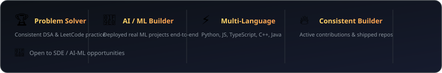

<div align="center">


<br><br>

<a href="https://git.io/typing-svg">
  
</a>

<br><br>

<a href="https://github.com/algorhythm11">
  
</a>
<a href="https://www.linkedin.com/in/mohit-raj-40545331b">
  
</a>
<a href="mailto:mohitraj191130@gmail.com">
  
</a>

<br><br>


</div>

---

## 👨‍💻 About Me

Hi, I'm **Mohit Raj**, a Computer Science & Engineering student interested in **Software Development, Artificial Intelligence, Machine Learning and Backend Engineering**.

I enjoy building practical applications that combine software engineering with AI/ML, while continuously improving my problem-solving skills through **DSA and LeetCode**.

- 🎓 Computer Science & Engineering student
- 💻 Interested in Software Development and Backend Engineering
- 🤖 Exploring AI/ML, Deep Learning and Computer Vision
- 🐍 Strong focus on Python
- 🌐 Building full-stack applications with React and TypeScript
- ⚙️ Developing APIs and backend systems with FastAPI
- 🗄️ Working with MongoDB and SQL
- 🧩 Practicing Data Structures & Algorithms
- ☁️ Learning cloud deployment and system design
- 🚀 Building and deploying real-world projects

---

## 🧠 Current Focus

```text
Software Development
        │
        ├── Frontend → React + TypeScript + Tailwind CSS
        │
        ├── Backend  → Python + FastAPI + REST APIs
        │
        ├── Database → MongoDB + SQL
        │
        ├── AI / ML  → Machine Learning + Deep Learning
        │
        ├── DSA      → LeetCode + Problem Solving
        │
        └── Cloud    → Deployment + Backend Architecture
```

---

# 🛠️ Tech Stack

### 💻 Languages

<p align="center">
  
</p>

### 🌐 Frontend

<p align="center">
  
</p>

### ⚙️ Backend, Database & Tools

<p align="center">
  
</p>

### 🤖 AI / ML

<p align="center">
  
</p>

<p align="center">
  
  
  
  
  
</p>

---

# 🚀 Featured Projects

## 🏪 VyaparAI — AI-Powered Business Platform

<div align="center">

<a href="https://github.com/algorhythm11/VyaparAI">
  
</a>

<a href="https://vyaparai-backend-vdko.onrender.com">
  
</a>

</div>

**VyaparAI** is a full-stack AI-powered business platform designed to combine business management, analytics and AI assistance in one application.

### ✨ Key Features

- 🤖 AI-powered business assistance
- 📊 Business dashboard and analytics
- 🔐 User authentication
- 👤 User management
- ⚙️ REST API architecture
- 🗄️ MongoDB database integration
- 🌐 Responsive React frontend
- 🧠 Gemini-powered AI capabilities
- ☁️ Cloud deployment
- 🔄 Frontend ↔ Backend integration

### 🧰 Technology Stack

| Layer | Technology |
|---|---|
| Frontend | React, TypeScript, Tailwind CSS |
| Backend | Python, FastAPI |
| Database | MongoDB |
| AI | Gemini API |
| Frontend Deployment | Vercel |
| Backend Deployment | Render |
| Version Control | Git & GitHub |

### 🏗️ Architecture

```text
                         ┌─────────────────┐
                         │      User       │
                         └────────┬────────┘
                                  │
                                  ▼
                    ┌────────────────────────┐
                    │    React Frontend      │
                    │ TypeScript + Tailwind  │
                    └───────────┬────────────┘
                                │
                             REST API
                                │
                                ▼
                    ┌────────────────────────┐
                    │    FastAPI Backend     │
                    │        Python          │
                    └───────────┬────────────┘
                                │
                    ┌───────────┴───────────┐
                    ▼                       ▼
             ┌──────────────┐       ┌──────────────┐
             │   MongoDB    │       │  Gemini API  │
             │   Database   │       │      AI      │
             └──────────────┘       └──────────────┘
```

### ☁️ Deployment

```text
Frontend   → Vercel
Backend    → Render
Database   → MongoDB
Repository → GitHub
```

### ⚡ Loading / Performance

The frontend is deployed on **Vercel** and the backend is deployed on **Render**.

If the Render backend is on a sleeping/free instance, the **first API request can take longer because the backend needs to wake up**. Once active, subsequent requests are generally faster.

This is normal cloud **cold-start behavior**.

---

## 💳 Credit Card Fraud Detection AI

<div align="center">

<a href="https://github.com/algorhythm11/credit_card_Fraud-Detection-AI">
  
</a>

</div>

A Machine Learning project focused on identifying potentially fraudulent financial transactions.

### 🔍 Key Areas

- 📊 Exploratory Data Analysis
- 🧹 Data preprocessing
- ⚖️ Imbalanced data handling
- 🤖 Machine Learning
- 📈 Model evaluation
- 🔎 Fraud pattern analysis
- 📊 Data visualization

### 🧰 Technologies

```text
Python
Pandas
NumPy
Scikit-Learn
Matplotlib
Machine Learning
Google Colab
```

---

## 🧩 LeetCode & DSA

<div align="center">

<a href="https://github.com/algorhythm11/leetcode">
  
</a>

</div>

I regularly practice **Data Structures & Algorithms** to improve logical thinking, coding ability and interview preparation.

### 📚 Topics

```text
Arrays
Strings
Hashing
Two Pointers
Sliding Window
Binary Search
Linked Lists
Stacks & Queues
Trees
Binary Search Trees
Recursion
Greedy Algorithms
Dynamic Programming
Graphs
```

---

# 📊 GitHub Statistics

<div align="center">

<a href="https://github.com/algorhythm11">
  
</a>

<a href="https://github.com/algorhythm11?tab=repositories">
  
</a>

<a href="https://github.com/algorhythm11?tab=followers">
  
</a>

<br><br>

<a href="https://github.com/algorhythm11">
  
</a>

<a href="https://github.com/algorhythm11?tab=overview">
  
</a>

</div>

> **Why no external GitHub Stats cards?**  
> The common `github-readme-stats` and streak services depend on third-party servers and GitHub API requests. If those services are rate-limited or unavailable, GitHub displays broken images. This README intentionally uses GitHub/Shield-based badges here so the profile does not show broken statistics cards.

---

# 📈 GitHub Activity

<div align="center">

<a href="https://github.com/algorhythm11">
  
</a>

</div>

> If this third-party activity graph ever fails, it can be removed without affecting the rest of the README.

---

# 🏆 Achievements

<div align="center">



</div>

---

# 📚 Currently Learning

<div align="center">

| Area | Focus |
|---|---|
| 🤖 AI / ML | Machine Learning, Deep Learning, CNNs |
| 👁️ Computer Vision | Image Processing & Deep Learning |
| ⚙️ Backend | FastAPI, REST APIs & Architecture |
| 🌐 Full Stack | React, TypeScript & Tailwind |
| 🧩 DSA | LeetCode & Algorithmic Problem Solving |
| 🏗️ System Design | Scalable Backend Architecture |
| ☁️ Cloud | Deployment & Cloud Fundamentals |
| 🧠 AI Applications | LLM-powered Applications |

</div>

---

# 💼 What I Build

<div align="center">


<br>


<br>


</div>

---
🐍 Contribution Snake

<div align="center">


<br/>

<b>My GitHub contributions, turned into a snake animation 🐍</b>

</div>

# 📫 Connect With Me

<div align="center">

<a href="https://www.linkedin.com/in/mohit-raj-40545331b">
  
</a>

<a href="mailto:mohitraj191130@gmail.com">
  
</a>

<a href="https://github.com/algorhythm11">
  
</a>

</div>

---

<div align="center">

### 🚀 Build • Learn • Debug • Improve • Ship

<br>


</div>

